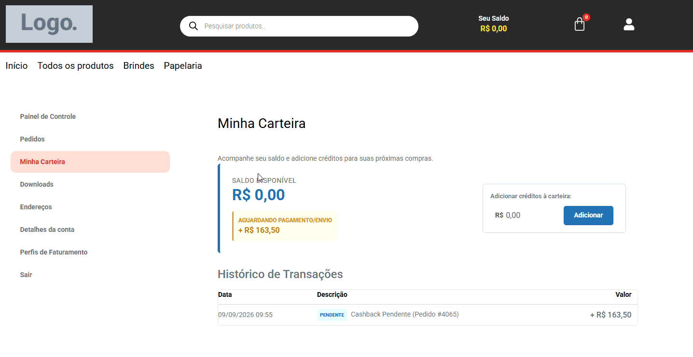
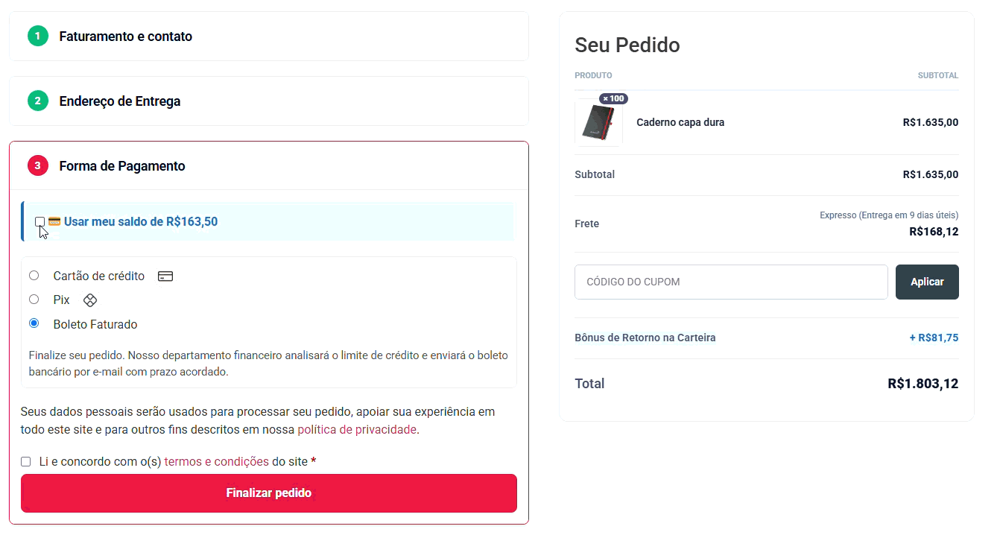
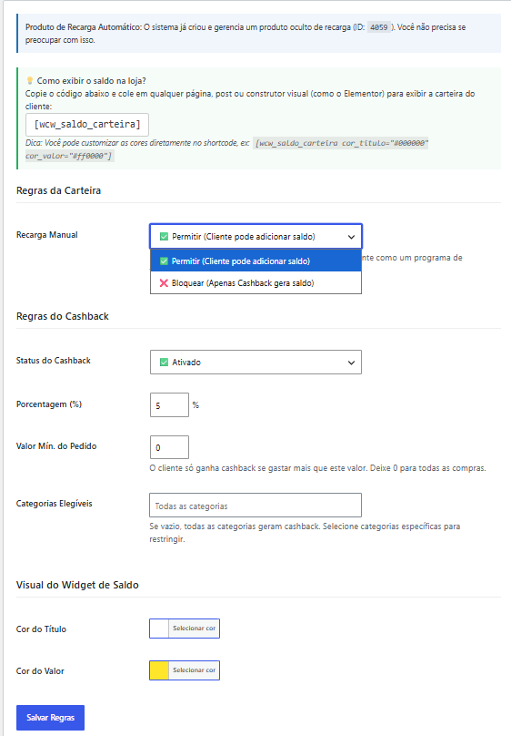

# 💳 WooCommerce Digital Wallet & Intelligent Cashback

Um motor financeiro de missão crítica para WooCommerce que introduz um sistema de Carteira Digital (Wallet) e Cashback Inteligente. Desenvolvido com arquitetura antifraude e tolerância a falhas de concorrência, focado em aumentar a retenção de clientes (LTV) e a recorrência de compras de forma segura.

---

## 🎯 O Problema de Negócio Resolvido

Aumentar a fidelidade do cliente e reduzir o custo de aquisição (CAC) são os maiores desafios do e-commerce moderno. Este plugin resolve isso permitindo que o lojista devolva uma porcentagem da compra como crédito (Cashback) para uso futuro, além de aceitar recargas antecipadas.

**Prevenção de "Dinheiro Infinito" (Rateio Proporcional):** Sistemas de cashback mal dimensionados podem gerar ciclos de saldo infinito quando o cliente paga uma nova compra utilizando o próprio crédito da carteira. Este motor previne essa falha lógica aplicando um rateio matemático rigoroso: o cálculo do cashback incide exclusivamente sobre o capital novo (dinheiro real) processado pelo Gateway de Pagamento, descontando proporcionalmente qualquer fração do pedido que tenha sido paga com o saldo preexistente.

**Blindagem para Faturamento B2B (Shadow Ledger):** Em operações de atacado (B2B) que utilizam boletos para 30 ou 60 dias via ERP, emitir o cashback na hora da compra gera um "furo de caixa", pois o cliente pode usar o bônus antes de pagar a dívida. O sistema resolve isso retendo o saldo como *Pendente* no extrato, e só realiza a liquidação automática quando o Webhook do ERP confirma o pagamento real no banco.

---

## 🎬 Demonstração Visual

### Painel do Cliente (Extrato e UX Financeira)

### Checkout e Uso de Saldo

### Configurações de Regras no Backend

---

## 🏗️ Engenharia Financeira & Arquitetura Sênior

Sistemas que lidam com saldo exigem rigor bancário. Este plugin foi arquitetado sob os seguintes pilares:

* **Single Source of Truth (Ledger Imutável):** O saldo do usuário não é armazenado em cache no `wp_user_meta` (o que gera dessincronização). Ele é calculado dinamicamente no banco de dados através da soma de uma tabela customizada (`wcw_transactions`) com status baseados em *Event-Driven Architecture*.
* **Máquina de Estados (State Machine):** Separação estrita de status (`pending`, `cleared`, `cancelled`). Isso permite provisionar saldos para o cliente visualizar no painel, bloqueando o saque até a efetiva liquidação bancária via WooCommerce Hooks.
* **Prevenção de Double-Spending (Gasto Duplo):** O motor financeiro (`WalletManager`) utiliza transações SQL (`START TRANSACTION`) atreladas a travas de linha (`FOR UPDATE`). Isso impede que requisições de saque simultâneas burlem a verificação de saldo.
* **Mitigação de Race Conditions:** Gateways enviam webhooks duplicados no mesmo milissegundo. A injeção de fundos utiliza um **Mutex Atômico** (via `add_option`), garantindo que o pedido seja processado estritamente uma única vez.
* **Arquitetura MVC & Template Overrides:** Views desacopladas em `/templates/`. O carregamento feito via `wc_get_template()` permite que desenvolvedores front-end sobrescrevam o layout em seus *Child Themes* sem alterar o Core do plugin.

---

## 📂 Estrutura de Diretórios

    digital-wallet-for-woocommerce/
    ├── assets/
    │   ├── css/
    │   └── js/
    ├── src/
    │   ├── Admin/
    │   │   └── Settings.php
    │   ├── Core/
    │   │   ├── Install.php
    │   │   └── WalletManager.php
    │   ├── Frontend/
    │   │   ├── CartRecharge.php
    │   │   ├── CheckoutCashback.php
    │   │   ├── MyAccountTab.php
    │   │   └── Shortcodes.php
    │   └── Init.php
    ├── templates/
    │   ├── admin-settings.php
    │   └── my-account-wallet.php
    ├── composer.json
    ├── digital-wallet-for-woocommerce.php
    └── README.md

---

## ⚙️ Instalação em Ambiente de Desenvolvimento

1. Clone o repositório na pasta de plugins do WordPress:
   `git clone https://github.com/seu-usuario/digital-wallet-for-woocommerce.git wp-content/plugins/digital-wallet-for-woocommerce`

2. Acesse a pasta e gere o autoloader:
   `cd wp-content/plugins/digital-wallet-for-woocommerce && composer dump-autoload -o`

3. Ative o plugin no painel do WordPress e acesse **Carteira Digital** para definir as porcentagens, travas de recarga e regras de negócio.

---

## 🛠️ Troubleshooting (Solução de Problemas)

**A aba "Minha Carteira" não apareceu na página Minha Conta ou está retornando Erro 404?**

Isso ocorre porque o WordPress faz cache das rotas de URL estruturais (Rewrite Rules). Se a sua infraestrutura ou tema bloqueou a limpeza automática durante a instalação, o WordPress não saberá que o novo painel da carteira existe.

Para forçar a reconstrução das rotas, siga este passo simples:
1. No painel do WordPress, navegue até **Configurações > Links Permanentes** (*Settings > Permalinks*).
2. Role até o final da página e clique no botão **Salvar Alterações** *(Não é necessário alterar nenhuma opção na tela, o simples ato de salvar força o flush do cache).*
3. Atualize a página "Minha Conta" da sua loja e a aba "Minha Carteira" estará operando normalmente.

## 📄 Licença
Distribuído sob a licença GPL-3.0.